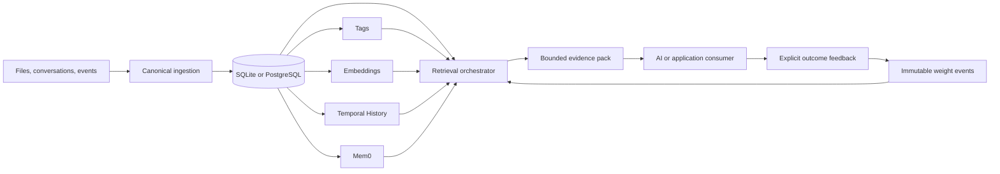

# Cortex

**Explainable, adaptive retrieval for long-lived AI memory.**

[](https://github.com/DimitrisKaintasis/Cortex/actions/workflows/ci.yml)

Cortex ingests text evidence and structured text records, preserves the original evidence, and
retrieves it through lexical, semantic, tag, relationship, and temporal signals. Every result
includes its provenance and score breakdown, while explicit outcome feedback improves future
routing without rewriting source material.

Cortex is the product name; `data-retrieval` is the Python package and command-line interface.

> **Current status:** a working local MVP with selectable SQLite or PostgreSQL/pgvector storage,
> explainable retrieval, feedback learning, a loopback-only API, recovery tooling, and
> deterministic evaluation gates. Privacy-preserving collective learning is an isolated research
> track and does not affect normal retrieval.

**Storage choice:** start with SQLite. PostgreSQL is an optional scale backend, not a second
database that must run alongside it. Each Cortex installation uses one authoritative backend;
Cortex does not dual-write or automatically synchronize the two.

[Quick start](#quick-start) · [Database choice](#which-database-should-i-use) ·
[How it works](#how-it-works) ·
[Evaluation](#evaluation) · [Project status](#project-status) ·
[Documentation](#documentation) · [License](#license-and-hosted-direction)

## Why Cortex exists

Long-lived AI systems need more than a vector database. They need to answer questions such as:

- Where did this memory come from?
- Is this the current state, an older state, or a model-generated summary?
- Why did this result rank above another result?
- Can feedback improve retrieval without silently changing the underlying facts?
- Can an inference provider be replaced without migrating the source of truth?

Cortex treats source evidence, derived interpretations, and learned routing signals as different
things. Raw evidence remains canonical. Tags, embeddings, temporal summaries, and Mem0 entities
are versioned projections with lineage. Feedback updates bounded learned relationships and is
recorded in an immutable event ledger.

## What it does

- **Canonical ingestion** — deterministic document and atom IDs, ordered chunks, character
  offsets, metadata, namespaces, timestamps, and replay-safe writes.
- **Hybrid retrieval** — lexical, explicit/generated tag, semantic, learned-relationship, and
  temporal channels with inspectable per-channel scores.
- **Time-aware evidence** — current-state, as-of, bounded-range, and history modes, plus optional
  calendar summaries through Temporal History.
- **Explainable learning** — attributable positive or negative feedback changes only bounded
  behavioral weights; it never rewrites source atoms or factual provenance links.
- **Replaceable processors** — Ollama or OpenRouter can provide tag and temporal enrichment,
  Ollama provides embeddings, and Mem0 sits behind an adapter rather than owning canonical truth.
- **Selectable storage adapter** — use SQLite for a zero-service local workflow or
  PostgreSQL/pgvector for indexed, bounded-candidate retrieval and resumable large-file
  ingestion. A deployment uses one, not both.
- **Local application API** — FastAPI endpoints for ingestion, retrieval, feedback, namespace
  inspection, and tag-candidate review, bound to laptop loopback only.
- **Operational safety** — checkpointed processing, idempotent retries, weight audits, and
  checksummed PostgreSQL backup/restore verification.

## Quick start

The smallest useful path needs only Python and SQLite. Ollama, PostgreSQL, Mem0, and Temporal
History are optional.

### Which database should I use?

For most readers, the answer is SQLite. Both adapters implement the same canonical repository
contract, but they serve different operating needs:

| Choose SQLite when… | Choose PostgreSQL when… |
|---|---|
| You are trying Cortex, developing locally, or running tests and evaluations. | You are operating a larger or longer-running corpus. |
| You want a single local database file with no service or Docker setup. | You need pgvector, indexed bounded-candidate retrieval, or stronger concurrent access. |
| Your priority is the shortest path from clone to working retrieval. | You need resumable, bounded-memory ingestion for large files and verified backup/restore tooling. |

This is a deployment choice, not a two-database pipeline. Source evidence, derived artifacts, and
learned weights live in the selected backend. Cortex does not replicate between SQLite and
PostgreSQL, and switching an existing installation would require an explicit migration rather
than changing a connection flag.

### 1. Install

Python 3.13 or newer is required.

```powershell
git clone https://github.com/DimitrisKaintasis/Cortex.git
cd Cortex

python -m venv .venv
.\.venv\Scripts\Activate.ps1
python -m pip install --upgrade pip
python -m pip install -e .
```

On macOS or Linux, activate the environment with `source .venv/bin/activate` instead.

The default install is the complete SQLite path; it does not install PostgreSQL, FastAPI, Mem0,
or Temporal History. Add only the capabilities you intend to run:

| Capability | Install command |
|---|---|
| Local API | `python -m pip install -e ".[api]"` |
| PostgreSQL/pgvector | `python -m pip install -e ".[postgres]"` |
| Temporal History | `python -m pip install -e ".[temporal]"` |
| LongMemEval benchmarks | `python -m pip install -e ".[benchmarks]"` |
| Mem0 integration | `python -m pip install -e ".[mem0]"` |
| Every optional runtime capability | `python -m pip install -e ".[all]"` |
| Tests and linting | `python -m pip install -e ".[dev]"` |

Extras can be combined, such as `python -m pip install -e ".[api,postgres]"` for the local API
with PostgreSQL. Optional commands remain visible in CLI help; if an extra is missing, the command
exits with the exact installation instruction instead of failing during normal SQLite startup.

### 2. Ingest a document

Create a small UTF-8 file:

```powershell
python -c "from pathlib import Path; Path('notes.txt').write_text('Cortex stores canonical evidence in SQLite. PostgreSQL with pgvector is the scale target. Ollama provides optional local embeddings.', encoding='utf-8')"
```

Ingest it with explicit tags. This creates `cortex.sqlite3` on the local machine and does not call
an AI model or external service.

```powershell
python -m data_retrieval ingest .\notes.txt `
  --db .\cortex.sqlite3 `
  --namespace demo `
  --source readme-demo `
  --tag architecture `
  --tag storage
```

The command returns stable `document_id` and `atom_ids` values. Repeating it is idempotent.

### 3. Retrieve evidence

```powershell
python -m data_retrieval retrieve "Where does Cortex store canonical evidence?" `
  --db .\cortex.sqlite3 `
  --namespace demo `
  --tag storage `
  --top-k 3
```

The JSON response contains a `retrieval_id` and ranked evidence items. Each item includes the
canonical `atom_id`, content, provenance metadata, temporal role, and a score breakdown similar
to:

```json
{
  "score": {
    "tag": 0.0,
    "lexical": 0.0,
    "semantic": 0.0,
    "relationship": 0.0,
    "temporal": 0.0,
    "final": 0.0,
    "evidence": ["channel-specific explanation"]
  }
}
```

The numbers above show the response shape, not fixed expected values. Semantic scores appear only
when an embedding model is configured.

### 4. Optional: open the local API

```powershell
python -m pip install -e ".[api]"
python -m data_retrieval serve-api --db .\cortex.sqlite3 --port 8765
```

Open `http://127.0.0.1:8765/docs` for the generated API interface. The server deliberately binds
only to `127.0.0.1` and has no public authentication boundary. Do not expose it through port
forwarding or a public reverse proxy. See the [local API runbook](docs/LOCAL-API.md) for the
request sequence and operating model.

## How it works



The central design rule is that processors can propose interpretations, but they cannot overwrite
canonical evidence or control final retrieval.

`SQLite or PostgreSQL` in the diagram is an exclusive choice for a deployment. It represents one
canonical data model behind two repository adapters, not two sources of truth.

### Retrieval flow

1. A query becomes a plan containing its namespace, optional tags, time constraints, and result
   budget.
2. Independent channels produce bounded candidates: lexical, semantic, tag, learned
   relationships, and temporal evidence.
3. The retrieval service fuses those signals and applies strict temporal eligibility when the
   query asks for current, historical, as-of, or range-bounded evidence.
4. The evidence pack balances raw and derived material while preserving lineage and exposing why
   each item ranked.
5. If the caller supplies explicit feedback, Cortex records the outcome and applies small,
   attributable updates to learned relationships only.

### Core graph

```text
Document -[:CONTAINS {position}]-> Atom
Atom     -[:HAS_TAG {weight_raw, confidence, origin}]-> Tag
Atom     -[:LINKS_TO {relation}]-> Atom
Tag      -[:RELATED_TO {relation_type, weight_raw}]-> Tag
```

An atom also records whether it is source evidence, a derived interpretation, an interaction, or
an uncertainty. Derived atoms must point back to the source atoms that support them.

For component ownership, invariants, and processor contracts, read the
[authoritative architecture](docs/ARCHITECTURE.md).

## Project status

| Area | Maturity | What that means |
|---|---|---|
| Canonical ingestion and SQLite | Implemented | Deterministic identities, provenance, transactions, hydration, and idempotent replay are covered by tests. |
| Explainable hybrid retrieval | Implemented | Lexical, tag, semantic, relationship, and temporal channels produce traceable scores; model-backed channels are optional. |
| Feedback learning | Implemented | Attributable, bounded updates and immutable weight events are active in the local workflow. |
| PostgreSQL/pgvector | Implemented, laptop deployment | Indexed candidates, staged large-file ingestion, backup, and verified restore are available; this is not a hosted service. |
| Tags, Temporal History, and Mem0 adapters | Implemented, still being evaluated | Processor boundaries and provenance are present; real-model quality varies by model and dataset. |
| Loopback API | Implemented, local only | Useful for local apps and scripts; public authentication and internet deployment are intentionally absent. |
| Collective learning | Shadow experiment | Cross-user transfer and review policies run in deterministic isolation and cannot mutate normal serving state. |
| Production UI and multi-tenant service | Not implemented | The current product surface is the CLI and local API. |

This distinction is deliberate: a passing integration or deterministic fixture is evidence that
a contract works, not proof of production retrieval quality.

## Evaluation

Cortex keeps deterministic contract gates separate from model and dataset quality experiments.
That prevents a strong combined score from hiding a broken subsystem.

| Check | Current evidence | Reproduce |
|---|---|---|
| Isolated architecture contracts | 7/7 gates passed on September 17, 2026: canonical core, Mem0 boundary, Temporal projection, tags, outcome learning, retrieval channels, and evidence packing. Fixed model outputs and deterministic embeddings are used. | `python -m data_retrieval evaluate-capabilities` |
| Retrieval corpus without embeddings | 5/9 hit@1, 0 temporal forbidden-result violations. The expected semantic and multilingual cases fail without an embedding provider. | `python -m data_retrieval evaluate --db :memory:` |
| Retrieval corpus with local embeddings | Both Harrier F16 and `qwen3-embedding:0.6b` scored 9/9 hit@1 with 0 temporal forbidden-result violations in the August 20, 2026 small warmed run. | See the [embedding benchmark](docs/EMBEDDING-BENCHMARK.md) |
| LongMemEval Oracle evidence retrieval | Across 470 answer-bearing cases, exact raw atoms reached 94.04% turn hit@10, 82.04% turn recall@10, and 0.796 MRR. Crediting source lineage covered by retrieved temporal summaries raised those metrics to 100%, 98.34%, and 1.000; both views are reported to avoid overstating direct retrieval. | See the [LongMemEval report](docs/LONGMEMEVAL.md#full-oracle-pipeline) |
| LoCoMo learning-transfer pilot | The fixed 67-question evaluation did not clear its promotion gate, so no tested learning multiplier was promoted. | See the [LoCoMo report](docs/LOCOMO-LEARNING-TRANSFER.md#results) |
| Integrated project-history flow | Ingestion, tag enrichment, Temporal History, hybrid retrieval, and explicit feedback passed all eight scenarios in the recorded acceptance run. | See the [acceptance report](docs/PROJECT-HISTORY-ACCEPTANCE.md) |

These are integration and regression baselines, not production-quality claims. Real-model
precision, recall, latency, cost, long-run feedback effects, and larger-corpus behavior remain
active evaluation areas.

Run the complete Python test suite with:

```powershell
python -m unittest discover -s tests -v
```

Developer tooling is optional:

```powershell
python -m pip install -e ".[dev]"
python -m pytest
python -m ruff check src tests scripts/smoke_minimal_install.py
python -m pyright
```

GitHub Actions runs three independent checks on every push and pull request: a dependency-free
SQLite smoke test, the lint, typed-core and Python test suite, and the PostgreSQL adapter tests
against a real pgvector service container. This keeps the simple setup and scale adapter
verifiable separately. Pyright currently gates the domain, repository contracts, ingestion, and
core retrieval path; dynamic provider and persistence implementations will be added incrementally.

## PostgreSQL scale mode

This section is optional. If the SQLite workflow meets your needs, you do not need to configure
PostgreSQL or Docker. PostgreSQL replaces SQLite as the authoritative backend for that Cortex
installation when `--postgres-dsn` or `DATA_RETRIEVAL_POSTGRES_DSN` is supplied; it does not run
as a synchronized second store.

```powershell
python -m pip install -e ".[postgres]"

$env:DATA_RETRIEVAL_POSTGRES_PASSWORD = "replace-with-a-long-random-password"
docker compose -f .\compose.postgres.yml up -d

$env:DATA_RETRIEVAL_POSTGRES_DSN = `
  "postgresql://data_retrieval:$($env:DATA_RETRIEVAL_POSTGRES_PASSWORD)@127.0.0.1:5432/data_retrieval"
```

In the accepted deployment, the container runs on the laptop, binds PostgreSQL to laptop
localhost, and persists data in a Docker volume. The CLI still runs in the foreground on the
laptop. Model inference is optional and may run through laptop-local Ollama. Secrets are supplied
through the process environment and are never returned in CLI output.

Before large ingestion or upgrades, create a checksummed logical backup and prove that it can be
restored into an isolated temporary database:

```powershell
python -m data_retrieval postgres-backup
python -m data_retrieval postgres-verify-backup .\data\backups\postgres\<backup-name>.dump
```

The full setup, logging, update, backup, and recovery procedure belongs in the
[PostgreSQL runbook](docs/LAPTOP-POSTGRES.md), not in this overview.

## Optional AI enrichment

Canonical ingestion and lexical/tag retrieval do not require a model. When Ollama is available,
one checkpointed command can add tags and embeddings:

```powershell
python -m data_retrieval process-file .\notes.txt `
  --db .\cortex.sqlite3 `
  --namespace demo `
  --source readme-demo `
  --ollama-url http://127.0.0.1:11434 `
  --tag-model $env:OLLAMA_MODEL `
  --embedding-model $env:OLLAMA_EMBEDDING_MODEL `
  --embedding-profile harrier-retrieval-v1
```

Each stage writes durable completion markers to a report under `data/runs/`. Repeating the command
reuses completed work. New model-proposed tags are quarantined until a person promotes, merges,
or rejects them. The [local MVP runbook](docs/LOCAL-MVP-RUNBOOK.md) covers Temporal and Mem0 stages,
failure handling, and the exact laptop responsibilities.

## Technology

| Layer | Choice |
|---|---|
| Language | Python 3.13+ |
| Local/test storage | SQLite |
| Scale storage | PostgreSQL with pgvector |
| Local API | FastAPI and Uvicorn |
| Local inference | Ollama, behind provider adapters |
| Optional memory processor | Mem0 |
| Optional temporal processor | Temporal History |
| Evaluation | Versioned JSON fixtures, `unittest`/pytest, deterministic capability gates |

The system is model-independent by design: model identities and content hashes are stored with
derived artifacts, and changing a provider creates versioned output rather than silently replacing
old evidence.

## Repository map

```text
src/data_retrieval/
├── domain/          # canonical models and graph vocabulary
├── ingestion/       # deterministic chunking
├── services/        # ingestion, retrieval, enrichment, learning, pipelines
├── storage/         # memory, SQLite, and PostgreSQL repository adapters
├── retrieval/       # query plans, channels, temporal policy, evidence packing
├── tagging/         # normalization, proposals, and provider adapters
├── temporal/        # Temporal History bridge
├── mem0/            # Mem0 import, provenance, entities, and admission
├── calibration/     # teacher and tag-similarity signals
├── collective/      # isolated collective-learning research
├── benchmarks/      # evaluation runners
├── api.py            # loopback-only FastAPI transport
├── cli_parser.py     # command and argument schema
└── cli.py            # command dispatch and handlers

evals/               # versioned evaluation fixtures
tests/               # unit, contract, integration, and adapter tests
docs/                # architecture, runbooks, decisions, and experiment reports
scripts/             # diagnostic and benchmark utilities
```

## Limitations and direction

- There is no production web UI, public authentication boundary, hosted control plane, or
  multi-tenant authorization layer.
- SQLite is intended for local use and deterministic testing; PostgreSQL is the scale path.
- Model-backed tag, embedding, summary, and entity quality depends on the selected model and must
  be evaluated independently of the deterministic processor contract.
- The nine-case regression corpus is intentionally small. LongMemEval adds broader external
  evidence-retrieval coverage, while the LoCoMo pilot remains a three-history learning experiment
  rather than a generalizable quality claim.
- Schema compatibility is currently handled inside the adapters. A versioned migration policy is
  accepted in [ADR-0019](docs/decisions/0019-versioned-schema-migrations.md), but extracting the
  existing compatibility steps into ordered migrations remains implementation work.
- A generic external connector and agent boundary is accepted in
  [ADR-0020](docs/decisions/0020-external-connector-and-agent-boundary.md). Stable external-record
  lifecycle, the connector SDK, reference connectors, and MCP adapter remain planned work; the
  current API is still loopback-only.
- Mem0 vector cold-start and experience-learning policies have not cleared their promotion gates.
- Collective-learning work remains payload-free, isolated, and non-serving until privacy,
  poisoning, held-out quality, and rollback gates are satisfied.
- The current accepted deployment is laptop-only; background workers and remote inference
  ownership are deferred.

The dependency-ordered plan and progress log live in the
[execution roadmap](docs/EXECUTION-ROADMAP.md).

## License and hosted direction

The Cortex community core in this repository is open source under the
[Apache License 2.0](LICENSE). You may use, modify, distribute, and self-host it under that
license's terms.

The vendored Temporal History runtime under `src/temporal_history/` remains under its original
MIT license. See [third-party notices](THIRD_PARTY_NOTICES.md) for attribution and terms.

A future managed Cortex service may offer additional proprietary capabilities, operational
tooling, and hosted infrastructure that are not part of this repository. The open-source core is
intended to remain a substantial, independently useful system rather than a nonfunctional demo.

## Documentation

### Understand the system

- [Architecture and component contracts](docs/ARCHITECTURE.md)
- [Evidence-packing policy](docs/EVIDENCE-PACKING.md)
- [Architecture reconciliation and recovered scope](docs/ARCHITECTURE-RECONCILIATION.md)
- [Connector and agent API plan](docs/CONNECTOR-API-PLAN.md)
- [Architecture decision records](docs/decisions/)

### Run it locally

- [Local MVP runbook](docs/LOCAL-MVP-RUNBOOK.md)
- [Local API runbook](docs/LOCAL-API.md)
- [Laptop PostgreSQL and recovery runbook](docs/LAPTOP-POSTGRES.md)
- [Mem0 bootstrap runbook](docs/MEM0-BOOTSTRAP.md)

### Evaluate it

- [Isolated capability gates](docs/ISOLATED-CAPABILITY-GATES.md)
- [Embedding model benchmark](docs/EMBEDDING-BENCHMARK.md)
- [Tag proposal model benchmark](docs/MODEL-BENCHMARK.md)
- [LongMemEval ingestion and evaluation](docs/LONGMEMEVAL.md)
- [LoCoMo learning transfer](docs/LOCOMO-LEARNING-TRANSFER.md)
- [Project-history acceptance report](docs/PROJECT-HISTORY-ACCEPTANCE.md)

### Research tracks

- [Collective capability graph](docs/COLLECTIVE-CAPABILITY-GRAPH.md)
- [Collective transfer experiment](docs/COLLECTIVE-TRANSFER-EXPERIMENT.md)
- [Selective AI review experiment](docs/REVIEW-CASCADE-EXPERIMENT.md)
- [Mem0 vector cold-start experiment](docs/MEM0-VECTOR-COLD-START.md)
- [Mem0 experience benchmark](docs/MEM0-EXPERIENCE-BENCHMARK.md)

The root README is intentionally the front door. Detailed commands, recovery procedures,
experiment design, and edge-case caveats stay in the linked runbooks and reports.
